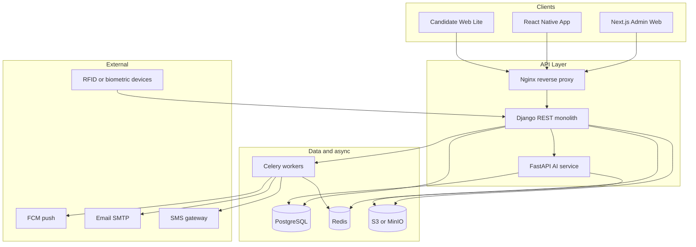
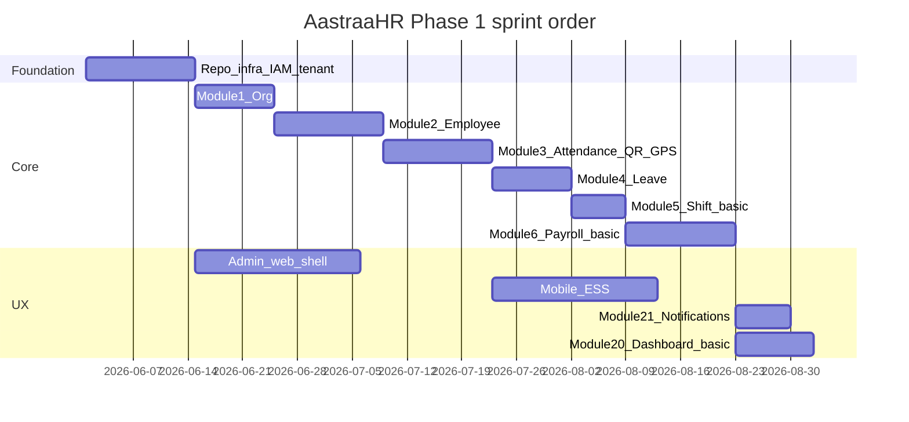

ACT AS A FULLSTACK DEVELOPER AND START BUILDING EACH AND EVERY MODULES WEB BASED FOR NOW DO NOT FOCUS ON MOBILE APP

JUST BUILD THE WEB APP FULLY RESPONSIVE FOR ALL ROLES

Role Description
Super Admin Platform-level admin for managing multiple companies/tenants
Company Admin Admin for one organization
HR Admin Manages employee data, onboarding, exits, letters, policies
Payroll Admin Manages salary, payroll, compliance, payslips
Finance Admin Handles reimbursements, expenses, payment reports
Manager Approves attendance, leave, expenses, performance reviews
Employee Uses ESS/mobile app for HR self-service
Recruiter Manages jobs, candidates, interviews, hiring pipeline
Interviewer Conducts manual interviews and reviews AI interview reports
Candidate Applies for jobs and attends AI interview
Auditor Read-only access to logs, payroll, compliance, and reports
IT Admin Manages access, devices, integrations, MFA, and security settings 

I DO NOT HAVE s3 for now so under config use ALLOW_S3 = False and if True it will use S3 else it will only use the storage under static/uploads


---
name: AastraaHR Module Plans
overview: "Phased greenfield implementation of AastraaHR per the BRD: modular Django monolith + Next.js admin + React Native mobile + FastAPI AI service, with per-module backend/frontend architecture and a LOCAL-DEVELOPMENT.md tooling manifest."
todos:
  - id: scaffold-monorepo
    content: Scaffold monorepo (api, admin-web, mobile, ai-service, infra/docker) + IAM/tenant foundation
    status: pending
  - id: local-dev-md
    content: Create docs/LOCAL-DEVELOPMENT.md with Docker services, tools, env templates, Windows setup
    status: pending
  - id: phase1-modules
    content: Implement Phase 1 modules 1-6, 13, 21, 22 + basic Module 20 dashboards
    status: pending
  - id: module-docs
    content: Add docs/modules/01-22 per-module spec MDs (APIs, models, FE routes)
    status: pending
  - id: phase2-modules
    content: "Phase 2: attendance devices, expenses, onboarding, helpdesk, assets, documents, exit"
    status: pending
  - id: phase3-ai-recruitment
    content: "Phase 3: ATS + FastAPI AI service (match, interview, reports)"
    status: pending
  - id: phase4-performance-psa
    content: "Phase 4: performance, engagement, timesheets, advanced analytics"
    status: pending
isProject: false
---

# AastraaHR — Per-Module Implementation Plan

Source: [HRMS - BRD - AastraaHR.pdf](file:///C:/Users/cogni/Downloads/HRMS%20-%20BRD%20-%20AastraaHR.pdf) (50 pages). Workspace [`c:\theastravision`](c:\theastravision) is empty — greenfield.

**Stack (confirmed):** Django REST Framework modular monolith, Next.js + TypeScript admin, React Native (Android/iOS), Python FastAPI AI service, PostgreSQL, Redis, Celery, S3-compatible object storage.

**Delivery artifact:** After approval, create [`docs/LOCAL-DEVELOPMENT.md`](docs/LOCAL-DEVELOPMENT.md) with the tooling list in Section 8 below (copy-paste ready for onboarding).

---

## 1. Platform architecture (shared)



### Monorepo layout (recommended)

| Path | Purpose |
|------|---------|
| `apps/api/` | Django project; one Django app per BRD backend module |
| `apps/admin-web/` | Next.js App Router, Ant Design + Tailwind |
| `apps/mobile/` | React Native (Expo or bare RN) |
| `apps/ai-service/` | FastAPI: resume match, interview, STT hooks |
| `packages/shared-types/` | OpenAPI-generated TS types (optional) |
| `infra/docker/` | `docker-compose` for local PG, Redis, MinIO, Mailhog |
| `docs/` | ADRs, module specs, `LOCAL-DEVELOPMENT.md` |

### Cross-cutting foundations (build before Module 1)

- **Multi-tenancy:** `tenant_id` on all tenant-scoped tables; middleware resolves tenant from subdomain or `X-Tenant-Id`; row-level filtering in managers/querysets.
- **IAM:** JWT access + refresh, RBAC (roles/permissions from Module 1), MFA (TOTP), device binding for attendance APIs.
- **Workflow engine (light):** generic `ApprovalRequest` + configurable steps (used by leave, expense, payroll, regularization) — avoid one-off approval tables per module.
- **Audit:** `AuditLog` on all admin/policy mutations (Module 22 + compliance).
- **Files:** presigned S3 uploads; virus scan hook (ClamAV in dev).
- **API style:** REST `/api/v1/{module}/...`; OpenAPI via drf-spectacular; consistent pagination/filtering.

### Frontend architecture (admin)

- **App shell:** auth layout, tenant switcher (Super Admin), sidebar by role permissions.
- **Data:** TanStack Query + generated or hand-maintained API client.
- **Forms:** React Hook Form + Zod; policy screens use master-data CRUD patterns.
- **State:** server state in Query; minimal client store (auth, tenant context).

### Frontend architecture (mobile)

- **Navigation:** role-based tabs (Employee vs Manager features).
- **Offline:** attendance queue + sync (Module 3); secure storage for tokens.
- **Device:** camera/GPS permissions for QR, geo, face flows.

---

## 2. Phase map (phased depth per your choice)

| Phase | Weeks (BRD) | Modules (priority) |
|-------|-------------|-------------------|
| **1 — MVP** | 10–14 | 1, 2, 3 (QR+GPS), 4, 5 (basic), 6 (basic), 13, 21, 22, IAM |
| **2 — Advanced HR** | 10–12 | 3 (RFID/bio/face), 5 (full), 7, 10, 15, 17, 18, 14, 20 (core reports) |
| **3 — Recruitment & AI** | 8–12 | 8, 9, candidate portal |
| **4 — Performance & PSA** | 10–12 | 11, 12, 16, 20 (advanced) |
| **5 — Enterprise** | ongoing | microservice split, BI, integrations |

Below: **detailed** plans for Phase 1–2 modules; **outline** for Phase 3–5 modules.

---

## Module 1: Organization and Tenant Management

**Phase:** 1 | **Django app:** `organization`

### Backend
- **Models:** `Tenant`, `CompanyProfile`, `Branch`, `Department`, `Designation`, `Grade`, `CostCenter`, `BusinessUnit`, `Role`, `Permission`, `UserRoleMapping`, `CompanyCalendar`, `EmployeeCodeSequence`.
- **APIs:** CRUD for org masters; hierarchy tree; tenant bootstrap; role-permission matrix; calendar CRUD.
- **Rules:** tenant isolation; immutable audit on policy changes; branch-scoped config keys (JSON) for later modules.

### Admin web
- Pages: Company profile, Branches, Org chart / departments, Designations & grades, Roles & permissions, Working calendar.
- Super Admin: tenant list/create (if multi-company platform).

### Mobile
- Read-only: company policies, holiday calendar reference (used by leave/attendance).

---

## Module 2: Employee Information Management

**Phase:** 1 | **Django app:** `employees`

### Backend
- **Models:** `Employee`, `EmployeeContact`, `EmployeeBank`, `EmployeeTax`, `EmployeeDocument`, `EmploymentHistory`, `Education`, `Family`, `Nominee`, lifecycle events (`Transfer`, `Promotion`, `Resignation`, etc.).
- **APIs:** create/update employee; profile GET; document upload; lifecycle actions with approval hooks; manager/reporting chain.
- **Integrations:** links to Module 1 masters; seeds Module 6 salary structure reference.

### Admin web
- Employee list (filters), profile wizard, document vault, lifecycle actions (transfer, promotion, exit trigger).

### Mobile
- Profile view; limited field update requests; document upload; letter/payslip download (links to 18/6).

---

## Module 3: Attendance Management

**Phase:** 1 (QR+GPS) → 2 (RFID/biometric/face) | **Django app:** `attendance`

### Backend (Phase 1)
- **Models:** `Shift` (basic), `AttendanceRule`, `AttendanceLog`, `AttendanceRegularization`, `GeoFence`, `QrSession` (dynamic QR).
- **APIs:** `POST /check-in`, `POST /check-out` (method: qr | gps); regularization CRUD + approval; daily/monthly reports; anti-fraud: device_id + GPS distance vs branch fence.
- **Jobs:** auto-absent marking; sync working hours to payroll staging table.

### Backend (Phase 2)
- Device integration service: `BiometricDevice`, `RfidReader`, webhook/sync endpoints, offline punch buffer + retry (Celery).
- Face enrollment + match API (proxy to Rekognition or local ML); liveness flag from mobile SDK.

### Admin web
- Attendance rules, geo-fences, QR generator (static/dynamic), live dashboard (present/absent/late), regularization approval queue, device health (Phase 2).

### Mobile
- Check-in/out UX per allowed methods; map/geo validation; regularization form; push confirmation (Module 21).

---

## Module 4: Leave Management

**Phase:** 1 | **Django app:** `leave`

### Backend
- **Models:** `LeaveType`, `LeavePolicy`, `LeaveBalance`, `LeaveRequest`, accrual ledger, sandwich/half-day rule config.
- **APIs:** apply/cancel; balance; team calendar; approve/reject (manager/HR); payroll export flag for LWP.
- **Jobs:** monthly accrual; carry-forward; encashment (Phase 2).

### Admin web
- Leave types & policies, balance adjustments, team calendar, approval inbox.

### Mobile
- Apply leave, balances, status, document attach (medical).

---

## Module 5: Shift, Roster and Overtime

**Phase:** 1 basic → 2 full | **Django app:** `shifts`

### Backend
- **Models:** `ShiftDefinition`, `RosterAssignment`, `ShiftSwapRequest`, `OvertimeRequest`, weekly off plan.
- **APIs:** CRUD shifts; bulk roster import (CSV); OT request + approval; compliance reports.
- **Integration:** feeds Module 3 rules (shift start/end, grace, OT calc).

### Admin web
- Shift master, roster grid upload, OT approval, reports (late, absent, roster compliance).

### Mobile
- View assigned shift/roster; OT request (employee); approve OT (manager).

---

## Module 6: Payroll Management

**Phase:** 1 basic → 2 statutory engine | **Django app:** `payroll`

### Backend (Phase 1)
- **Models:** `SalaryComponent`, `SalaryStructure`, `PayrollRun`, `PayrollLineItem`, `Payslip`, formula definitions (JSON).
- **APIs:** structure CRUD; `preview` → `approve` → `lock`; payslip PDF; bank export CSV.
- **Pipeline (Celery):** validate employees → pull attendance/LOP from Module 3/4 → calculate earnings/deductions → statutory stub tables.

### Backend (Phase 2)
- **Statutory rule engine:** versioned rules for PF, ESIC, PT, TDS, LWF; Form 16, ECR, ESIC reports; F&F settlement link (Module 19).

### Admin web
- Component builder, run payroll wizard (preview/approve/lock), payslip release, statutory reports.

### Mobile
- Payslip list/download; tax declaration submit (Phase 2).

---

## Module 7: Expense and Reimbursement

**Phase:** 2 | **Django app:** `expenses`

### Backend
- **Models:** `ExpenseCategory`, `ExpensePolicy`, `ExpenseClaim`, `ExpenseLine`, receipts in S3.
- **APIs:** submit with bills; policy validation (limits); multi-level approval; sync approved amount to payroll run.
- **Optional:** OCR job (Textract/Tesseract) → structured fields.

### Admin web
- Categories, policies, finance approval queue, exports.

### Mobile
- Camera bill upload, claim form, status tracking.

---

## Module 8: Recruitment / ATS

**Phase:** 3 | **Django app:** `recruitment`

### Backend
- **Models:** `JobRequisition`, `JobPost`, `Candidate`, `Application`, `PipelineStage`, `InterviewSchedule`, `Offer`.
- **APIs:** requisition workflow; public career apply; duplicate detection; stage transitions; offer generate/accept.
- **Integration:** triggers Module 9 on stage “AI interview assigned”; Module 10 on “Onboarding initiated”.

### Admin web
- Pipeline Kanban, candidate profile, scheduling, offer letter trigger (Module 18 templates).

### Mobile / Candidate portal
- Lightweight Next.js or mobile WebView: apply, status, document upload, offer accept.

---

## Module 9: AI Resume Matching and Interview

**Phase:** 3 | **FastAPI service:** `ai-service` + thin Django `recruitment_ai` client

### AI service (FastAPI)
- **Endpoints:** `/parse-resume`, `/parse-jd`, `/match`, `/generate-questions`, `/interview/start`, `/interview/answer`, `/interview/transcribe`, `/interview/evaluate`, `/interview/report`.
- **Stack:** PyMuPDF/docx parsers; embeddings + weighted scoring (configurable weights); LLM for Q gen + rubric scoring; Whisper/Azure STT; structured JSON reports.
- **Storage:** interview transcripts, optional A/V in S3; consent flags.

### Django orchestration
- Persist `AiInterview`, questions, answers, reports; recruiter override; audit AI decisions; human-in-loop before rejection.

### Admin web
- Match score dashboard, interview report viewer, weight config per job role.

### Candidate portal
- Secure magic-link interview; device checks; voice/text modes.

---

## Module 10: Onboarding Management

**Phase:** 2 | **Django app:** `onboarding`

### Backend
- **Models:** `OnboardingChecklist`, `OnboardingTask`, document requests, BGV status, asset requests (link Module 17).
- **APIs:** post-offer checklist; candidate portal tasks; auto-create `Employee` on completion.

### Admin web
- Template builder, per-candidate tracker, BGV/asset status.

### Mobile
- New joiner tasks (policies, forms) — limited until employee record exists.

---

## Module 11: Performance Management

**Phase:** 4 | **Django app:** `performance`

### Backend
- **Models:** `Goal`, `OKR`, `KPI`, `AppraisalCycle`, `Review`, `Calibration`, `PIP`.
- **APIs:** cycle setup; self/manager/360 reviews; rating calibration; increment/promotion recommendations.

### Admin web
- Cycle admin, calibration grid, reports.

### Mobile
- Self-review, feedback, goal updates.

---

## Module 12: Employee Engagement and Culture

**Phase:** 4 | **Django app:** `engagement`

### Backend
- Surveys, pulse, polls, recognition, announcements, mood tracker; anonymous response handling.

### Admin web
- Survey builder, analytics, newsfeed moderation.

### Mobile
- Feed, polls, recognition, mood check-in.

---

## Module 13: Employee Self-Service (ESS)

**Phase:** 1 | **Not a separate backend app** — composition layer

### Design
- **Admin:** N/A (employee uses mobile primarily).
- **Mobile screens:** aggregate APIs from 2, 3, 4, 6, 7, 15, 18, 22 — profile, leave, attendance, payslips, expenses, tickets, policies, directory, holidays, approval status.
- **BFF optional:** single `/ess/dashboard` aggregating counts for home screen.

---

## Module 14: Manager Self-Service (MSS)

**Phase:** 1 inbox → 2 full | **Composition + approvals**

### Design
- **Admin web:** “Manager” role sees team views: attendance, leave calendar, approvals (regularization, expense, OT), performance (Phase 4), hiring requests (Phase 3), team analytics widgets (Module 20).
- **Mobile:** manager tab mirroring approval queues.
- **Backend:** reuse workflow APIs; add `team_id` scoped queries on existing modules.

---

## Module 15: Helpdesk / Ticketing

**Phase:** 2 | **Django app:** `helpdesk`

### Backend
- **Models:** `Ticket`, `TicketComment`, `SLA`, categories (HR, Payroll, IT, etc.), escalation rules.
- **APIs:** CRUD, assign, escalate, close/reopen, CSAT.

### Admin web
- Agent queue, SLA config, category admin.

### Mobile
- Create ticket, thread, attachments.

---

## Module 16: Project Timesheet and PSA

**Phase:** 4 | **Django app:** `timesheets`

### Backend
- **Models:** `Client`, `Project`, `Task`, `Allocation`, `Timesheet`, `TimesheetEntry`, billing flags.
- **APIs:** weekly timesheet submit/approve; utilization and profitability reports.

### Admin web
- Projects, allocations, approvals, billing exports.

### Mobile
- Timesheet entry, task picker.

---

## Module 17: Asset Management

**Phase:** 2 | **Django app:** `assets`

### Backend
- Asset master, assignment/return, warranty, exit clearance hook (Module 19).

### Admin web
- Inventory, assign to employee.

### Mobile
- View assigned assets (read-only).

---

## Module 18: Document and Letter Management

**Phase:** 2 | **Django app:** `documents`

### Backend
- Templates (HTML/DOCX merge), generated letters, verification/expiry alerts, employee doc types.

### Admin web
- Template editor, generate letter, verification queue.

### Mobile
- Download letters; upload verified docs.

---

## Module 19: Exit Management

**Phase:** 2 | **Django app:** `exit` (or sub-module of `employees`)

### Backend
- Resignation workflow, notice period, clearance checklist (assets, IT, finance), F&F calc hook to payroll, relieving/experience letter generation.

### Admin web
- Exit pipeline board, clearance sign-off.

### Mobile
- Submit resignation, track status.

---

## Module 20: Analytics and Reporting

**Phase:** 1 basic dashboards → 4 advanced | **Django app:** `reporting`

### Backend
- Materialized views or reporting schema; endpoints per dashboard (HR, Payroll, Attendance, Recruitment, Performance); export XLSX/PDF via Celery + Pandas.
- Phase 5: Metabase/Superset optional.

### Admin web
- Dashboard pages per BRD Section 20; drill-down filters (dept, location, date range).

### Mobile
- Manager mini-widgets only (team attendance summary).

---

## Module 21: Notifications and Communication

**Phase:** 1 | **Django app:** `notifications`

### Backend
- `Notification`, `NotificationPreference`, channel adapters (in-app, email, SMS, FCM); event subscribers from other modules (signals or outbox table).
- **Outbox pattern:** transactional outbox → Celery dispatch for reliability.

### All clients
- In-app bell + read state; push registration on mobile; email templates.

---

## Module 22: Admin Configuration (low-code masters)

**Phase:** 1 ongoing | **Spans all apps**

### Backend
- Unified `MasterConfig` registry or per-domain admin APIs already in each module; workflow designer (steps, roles, conditions) stored as JSON.
- Feature flags per tenant for module enablement.

### Admin web
- “Settings” hub linking to all master screens; approval workflow UI; recruitment stage editor; interview templates.

---

## 3. Identity, security, and compliance (parallel track)

| Concern | Implementation |
|---------|----------------|
| Auth | `djangorestframework-simplejwt`, refresh rotation, MFA |
| RBAC | Module 1 permissions; DRF permission classes per view |
| Encryption | TLS; PG encryption at rest (cloud); field-level for PAN/Aadhaar |
| Attendance fraud | Device binding, geo fence, rate limits, audit |
| AI consent | `CandidateConsent` before interview; retention policy |
| Compliance | Versioned statutory rules (Module 6 Phase 2); audit logs immutable |

---

## 4. Database strategy

- **Single PostgreSQL database**, schema per logical module (prefix or app label).
- **Tenant scoping:** composite indexes `(tenant_id, ...)` on hot tables.
- **Reporting:** read replicas later; Phase 1 use SQL views + cached aggregates in Redis (5–15 min TTL for dashboards).
- **Migrations:** Django migrations per app; seed data for default roles, leave types, attendance rules.

Key entity list aligns with BRD Section 10 (tenants, employees, attendance_logs, payroll_runs, ai_interviews, etc.).

---

## 5. API surface (grouped by module)

Prefix all with `/api/v1/`. Auth module first, then org → employees → attendance → leave → payroll → … as in BRD Section 11. Publish OpenAPI; generate mobile/admin clients in CI.

---

## 6. Implementation order (sprints)



Phase 2+ sprints follow BRD Section 15 ordering.

---

## 7. Testing and quality gates

- **API:** pytest + factory_boy per Django app; tenant isolation tests mandatory.
- **E2E:** Playwright (admin critical paths: employee create → leave approve → payroll preview).
- **Mobile:** Detox or Maestro for check-in/leave flows.
- **AI:** golden-file tests for match scoring weights; mock LLM in CI.
- **Load:** attendance check-in peak simulation (Redis queue depth).

---

## 8. `docs/LOCAL-DEVELOPMENT.md` (to create on implementation)

Full tooling manifest for local dev:

### Required runtime and services
| Tool | Version hint | Purpose |
|------|----------------|---------|
| **Docker Desktop** | latest stable | Compose stack |
| **PostgreSQL** | 16+ | Primary DB (via compose) |
| **Redis** | 7+ | Cache, Celery broker, sessions |
| **MinIO** | latest | S3-compatible local object storage |
| **Python** | 3.12+ | Django API + FastAPI AI |
| **Node.js** | 20 LTS | Next.js admin |
| **pnpm or npm** | per repo | Admin web package manager |

### Optional local services (phase-dependent)
| Tool | Purpose |
|------|---------|
| **Mailhog** | Capture outbound email |
| **RabbitMQ** | Alternative Celery broker (BRD Option B; Redis is default) |
| **ClamAV** | Upload virus scan in dev |
| **FFmpeg** | AI interview media processing |
| **Poppler / PyMuPDF deps** | PDF resume parsing |

### Mobile development
| Tool | Purpose |
|------|---------|
| **React Native CLI / Expo** | Mobile app |
| **Android Studio + SDK** | Android emulator |
| **Xcode** (macOS only) | iOS simulator |
| **Java JDK 17** | Android builds |
| **Watchman** (macOS) | RN file watching |

### AI / ML local (Module 9)
| Tool | Purpose |
|------|---------|
| **OpenAI API key** or **Ollama** | LLM for dev without cloud |
| **faster-whisper** or API | Speech-to-text |
| **Tesseract** (optional) | OCR for expenses |

### Dev productivity
| Tool | Purpose |
|------|---------|
| **Git** | Version control |
| **pre-commit** | Lint/format hooks |
| **Ruff + mypy** | Python lint/types |
| **ESLint + Prettier** | TS/React |
| **direnv** (optional) | Env loading |
| **ngrok / Cloudflare Tunnel** | Webhook testing (biometric devices) |

### Suggested `docker-compose.yml` services
`postgres`, `redis`, `minio`, `mailhog`, `api`, `worker`, `ai-service`, `admin-web` (dev), optional `clamav`.

### Environment files (templates)
- `apps/api/.env` — `DATABASE_URL`, `REDIS_URL`, `JWT_SECRET`, `S3_*`, `CELERY_BROKER`
- `apps/ai-service/.env` — `OPENAI_API_KEY`, `WHISPER_MODEL`
- `apps/admin-web/.env.local` — `NEXT_PUBLIC_API_URL`
- `apps/mobile/.env` — API base URL, tenant id for dev

### One-command bootstrap (target)
```bash
docker compose -f infra/docker/docker-compose.yml up -d
cd apps/api && python manage.py migrate && python manage.py seed_dev
cd apps/admin-web && pnpm dev
```

---

## 9. Post-plan deliverables (after you approve)

1. Scaffold monorepo + Docker Compose per Section 8.
2. Write [`docs/LOCAL-DEVELOPMENT.md`](docs/LOCAL-DEVELOPMENT.md) with install links (Windows-focused), ports table, and troubleshooting.
3. Add [`docs/modules/`](docs/modules/) — one MD per module (01-organization.md … 22-admin-config.md) expanding API list and ERD snippets from this plan.
4. Begin Phase 1 Sprint 1: IAM + tenant + admin shell.

---

## 10. Risks and decisions logged

- **Biometric/RFID:** depends on vendor APIs — plan adapter interface in Module 3 Phase 2.
- **AI legal:** recommendation-only; human override required (BRD 9.5).
- **Statutory rates:** never hardcode; rule engine from day one of payroll Phase 2.
- **India-first:** multi-currency/global payroll out of MVP scope (BRD Section 18).
